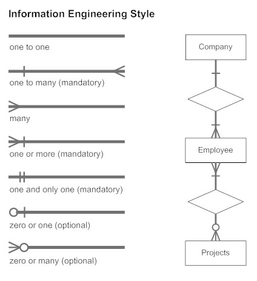

# 2• Forma Normal

- 🥸`Como está nos livros:` Uma entidade estará na 2ª forma normal se e somente se ela estiver na 1FN e todos os atributos não primários devem depender totalemnte da chave primária.
- 🤓`Como eu entendo:` A entidade estará na 2FN se todos os atributos que estão atrelados à entidade realmente fazem parte do contexto da entidade. Tentando ser mais claro, pela chave primária conseguimos identificar a entidade.
- 😍`Na prática:` Olhar para cada atributo dentro da entidade e se perguntar: "Esse atributo realmente faz sentido estar aqui? Por que ele está nessa entidade?"

Olhando novamente para nosso [modelo](https://drive.google.com/file/d/1stLD9aCuxpU3YGgjb9ruED1BDlmbb8AE/view?usp=sharing) até agora:

Podemos dizer que:

- As entidades `Proprietario`, `Veiculo`, `Estado`, `Cidade` estão na 2FN pois avaliando seus atributos em relação à suas respectivas chaves primárias sabemos que todos os seus atributos dependem da sua chave primária.

Porém ao realizar a análise na entidade `Registro Veiculo`, podemos identificar que:

- A `Data Inicio Posse` e o `Data Inicio Fim` não faz parte do registro. Esses atributos representam o periodo de posse do veiculo por um proprietário. O que por si só, todas esses dados devem ser armazenado de em uma outra entidade
- O `Proprietario` também não faz parte do registro do veículo, ele fará parte de uma nova entidade que chamaremos de `Proprietario Registro Veiculo`. 

## Relacionamentos

Na 1FN já pudemos perceber que as entidades se relacionam de uma forma ou de outra. Porém não criamos ainda nenhuma chave estrangeria. Já na 2FN, podemos deixar essas relações mais explicitas representado em noso diagrama os relacionamentos.

Para revisitar a [explicação dos relacionamentos](./README.md#relacionamentos).

### Entidades Associativas

A Entidade `Proprietario Registro Veiculo` é o que chamamos de entidades associativas (ou na implementação tabelas associativas). Que representam um cenário de relacionamentos de ***muitos para muitos (N:N)***. Nesse caso, criamos essa entidade intermediária onde geralmente sua chave primária será composta das entidades de origem do relacionamento de muitos para muitos.

Abaixo temos como representamos os relacionamentos nos diagramas de forma que fique mais claro a visualização:

E após aplicar o diagrama ficaria da seguinte forma: [2FN Aplicada](https://viewer.diagrams.net/?tags=%7B%7D&highlight=0000ff&edit=_blank&layers=1&nav=1&title=emd.drawio#R7Zpbc9soFMc%2FjWe6D%2Bno4lse49jpZnNZT7zdNvtGJSIzQeAiHF8%2BfUECSUiyLXviVPHmKeIAh8v5nb9Accu9DJdfGJhN76gPccux%2FGXLHbYcx7atc%2FFHWlaJpdfvJoaAIV81ygwTtIbKaCnrHPkwMhpySjFHM9PoUUKgxw0bYIwuzGZPFJujzkAAS4aJB3DZ%2Bg35fJpY%2Bx0rs%2F8JUTDl6YJVTQh0Y2WIpsCni5zJHbXcS0YpT57C5SXEcvP0viT9rjbUphNjkPA6Ha4eJ97d%2FWACf56FfXJH%2FrugnTPl5QXguVrwmNEZQ5ADhqiaOF%2Fp3YgWKMSAiNLAmyLs34IVncvRIw68Z10aTClDa0o4wKLKFgZRzbgKrti6fIuJ7CnM0sronPjQV52eRL3qY7d1Wc3Fip0y%2BpxGxZH9YSTaj%2FWWWKnpFkRcT0WHQdb6IJrG48kCwCgg4tkTvSGTBuap8eXwiynicDIDnjQsBO1yGTzUSyyHQ%2B8tZBwucyYVni%2BQhpCzlWiiajVUKlUcV5UXGXh2V9mmeeg0YkDBHqSuMx7Eg0JiDzycEh4tZyB6ONan2fMfLaeLZbh%2FMPEU8HgTBvdi6MqKIfXmodgcKnt%2FvUl7%2B%2Bgl3wpwIOVC%2BLDuQeQh1SVpKxZhNC%2FgqSOI4RNPAbmkmIpoDgmNuX1CGBdMkQgqIsFt3GvYLqAnwZIxREIULtQAnM40W%2BBHCiSjXMw%2BKwsYNHVbQdmambvpWZn07KKldyxY3BIs%2F0LkzfGHjLyxjLRNHbF%2Fu4y0q2Tk2q%2BUifgIQSurLkgZpVNKebd2pJuS8p1SYB9ggGQQhPUj%2B5uQ%2FWnwd0GS6sSrU9KtSP%2Bqd79m53q46X0%2FUEzJFtan8Y2ov9pwkkhMIs%2BJQV%2F355zGwiKACWJUzrxEGi7kMgjiSAI3yFrmRh9j4IHc3BLv5ojmfC%2BRD3yYTHfTTAcjQbZPS42Ki6%2FeMgJeQFg4UtXpqQ5aWb5u61rPesLS3KmdhntKc2p89azrlbIu4exDj99Uj%2FumHHdqg3G001j%2F0EvdCed3r3ZYm3L0Oi9FMXnXfKT3m6a322tcfutzXPm6ZSR49RkkfwDZ%2BF3nf%2FTiP68NRFOEwS5fysxvurkz34dUvKFUOOeF7zL9334zs6uuZoOqO3yVZphY7X31uCbIi3kc0yjaqC1bHFyhcFfvE1Ymu9l3kgCu2dfRX3%2FjcH3zHWPrm2WvKz4Rl0IE%2FQBqGaCMT2lACcCjzFra%2B9zWQeJfyH%2F6ieLoYQ0Z%2FYfeAbJKaq4Q1u0yJZJhgEvEv8vnz%2B2OKj5qh%2BJ5uMy1G65yhTFkSGyMVJPERsQmJZ46uviYr8tcxSXty5uzl1QXNypNROfMg1uIUJ9ZRT4GsMZlVu70VmzynFhVnGgjgxhw9AKN6VbBo8YYUyTWlgpjd5MwahfJylWv%2FL84C456BUdFP8nOlPzEKKfrPpzu8ot3K90ivoivHuK9o%2BSohBuAadztHOvWZ6ezHfcUbQPsjPMNaB9Os1OTZv0OawzOdoHCdvGoVxfn4oHBLTo6Ms9VHwqayLNG094PzVT2jTzYngaH49x9rzh3rB0U1sW5W3BUugIdGefyF5Nm4vya8uwcT5%2F7dYG2Gga00zU5TAHfF2i34KhddHRkoO3yr7dOkWjzLG0fDWgN6k6iG6fQbgHo80MVupgZRUfHBtp5X0Bnp4XHPMJ7KXTveArde6c8O4WfMLSL3yNqC3Rvh6ODeRbF7Je7SfPs98%2Fu6Bc%3D)

Agora que a 2FN foi aplicada, podemos pular para a [3FN](./3FN.md) e assim finalizar nosso estudo.
